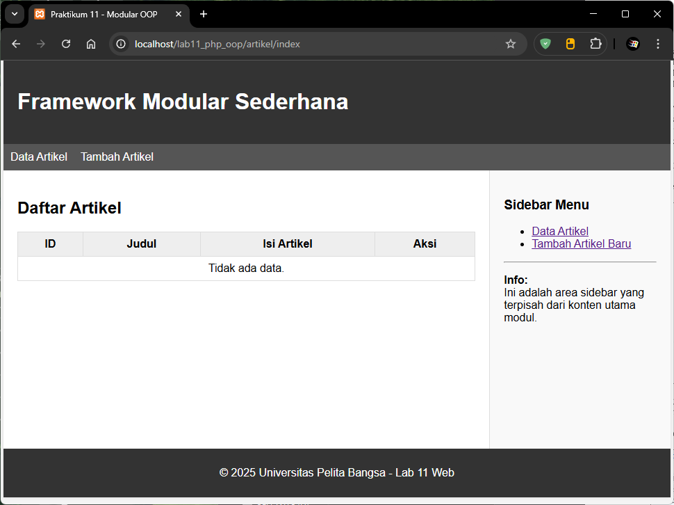
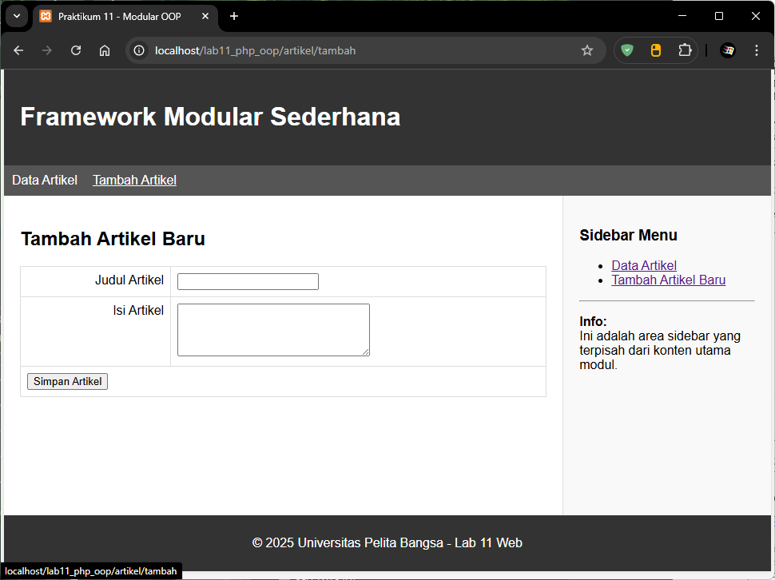
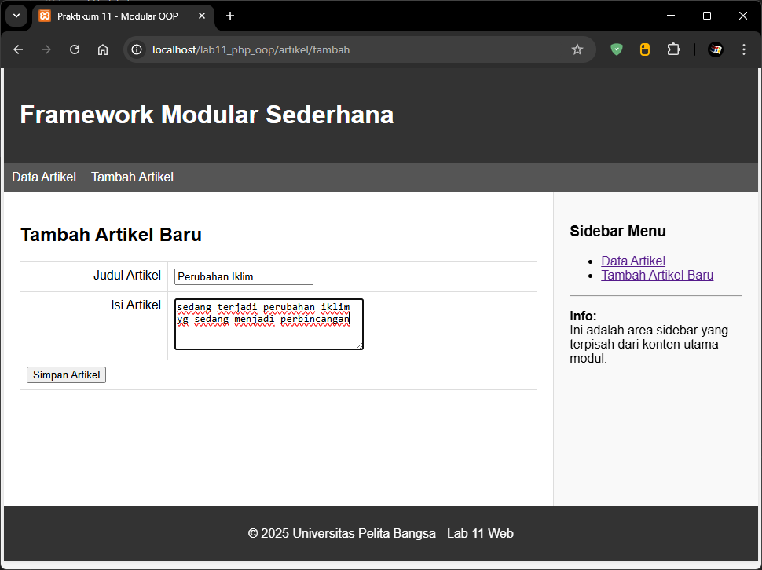
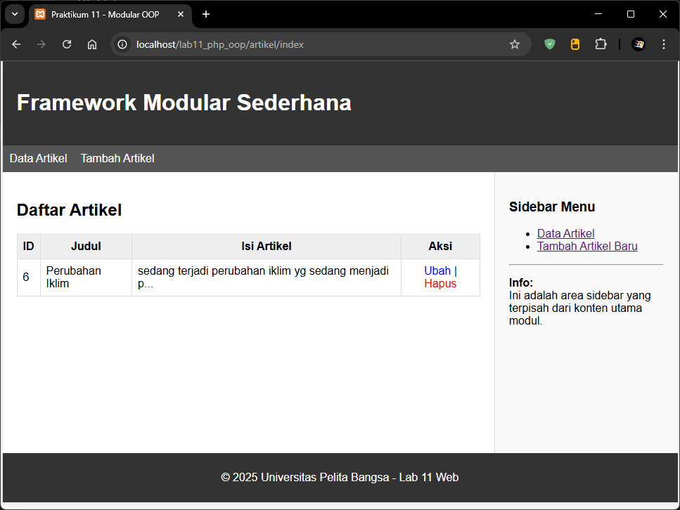

# Lab11Web

- Nama : Roufan Awaluna Romadhon
- NIM : 31240423
- Kelas : TI.24.A.3

---

## Deskripsi

Tugas ini untuk memahami konsep dasar Framework Modular, memahami konsep dasar routing dan membuar framework sederhana menggunakan PHP OOP.

## Langkah-langkah

### A. Perisapan Struktur Folder

```
lab11_php_oop/
├── .htaccess       (Konfigurasi URL Rewrite)
├── config.php      (Konfigurasi Database)
├── index.php       (Gerbang Utama / Routing)
├── class/          (Tempat menyimpan Library)
│ ├── Database.php
│ └── Form.php
├── module/         (Tempat modul-modul website)
│ └── artikel/
│ ├── index.php     (Menampilkan data)
│ ├── tambah.php    (Form tambah)
│ └── ubah.php
│ └── hapus.php
├── template/       (Bagian layout)
├── header.php
├── footer.php
└── sidebar.php
```

Langkah 1: Pindahkan file Database.php dan Form.php (dari praktikum sebelumnya) ke dalam folder class/.

File: form.php

```php
<?php
/**
  * Nama Class: Form
  * Deskripsi: Class untuk membuat form inputan dinamis (Text, Textarea, Select, Radio, Checkbox)
*/
class Form
{
    private $fields = array();
    private $action;
    private $submit = "Submit Form";
    private $jumField = 0;

    public function __construct($action, $submit)
    {
            $this->action = $action;
            $this->submit = $submit;
    }

    public function displayForm()
    {
        echo "<form action='" . $this->action . "' method='POST'>";
        echo '<table width="100%" border="0">';

        foreach ($this->fields as $field) {
            echo "<tr><td align='right' valign='top'>" . $field['label'] ."</td>";
            echo "<td>";
            
            // Logika untuk menentukan tipe input
            switch ($field['type']) {
                case 'textarea':
                    echo "<textarea name='" . $field['name'] . "' cols='30' rows='4'></textarea>";
                break;

                case 'select':
                    echo "<select name='" . $field['name'] . "'>";
                    foreach ($field['options'] as $value => $label) {
                        echo "<option value='" . $value . "'>" . $label . "</option>";
                    }
                    echo "</select>";
                    break;

                case 'radio':
                    foreach ($field['options'] as $value => $label) {
                        echo "<label><input type='radio' name='" . $field['name'] . "' value='" . $value . "'> " . $label . "</label> ";
                    }
                    break;

                case 'checkbox':
                    foreach ($field['options'] as $value => $label) {
                        // Untuk checkbox group, nama biasanya ditambah [] agar jadi array
                        echo "<label><input type='checkbox' name='" . $field['name'] . "[]' value='" . $value . "'> " . $label . "</label> ";
                    }
                    break;

                case 'password':
                    echo "<input type='password' name='" . $field['name'] . "'>";
                    break;

                default: // Defaultnya adalah text input biasa
                echo "<input type='text' name='" . $field['name'] . "'>";
                break;
            }

            echo "</td></tr>";
        }

        echo "<tr><td colspan='2'>";
        echo "<input type='submit' value='" . $this->submit . "'></td></tr>";
        echo "</table>";
        echo "</form>";
        }
    /**
    * addField
    * @param string $name Nama atribut (name="")
    * @param string $label Label untuk field
    * @param string $type Tipe input (text, textarea, select, radio, checkbox, password)
*     @param array $options Opsi untuk select/radio/checkbox (format:['value' => 'Label'])
    */

    public function addField($name, $label, $type = "text", $options = array())
    {
        $this->fields[$this->jumField]['name'] = $name;
        $this->fields[$this->jumField]['label'] = $label;
        $this->fields[$this->jumField]['type'] = $type;
        $this->fields[$this->jumField]['options'] = $options;
        $this->jumField++;
    }
}
?>
```

File: database.php

```php
<?php
class Database {
    protected $host;
    protected $user;
    protected $password;
    protected $db_name;
    protected $conn;

    public function __construct() {
        $this->getConfig();
        $this->conn = new mysqli($this->host, $this->user, $this->password, $this->db_name);
        if ($this->conn->connect_error) {
            die("Connection failed: " . $this->conn->connect_error);
        }
    }

    private function getConfig() {
        include("config.php");
        $this->host     = $config['host'];
        $this->user     = $config['username'];
        $this->password = $config['password'];
        $this->db_name  = $config['db_name'];
    }

    public function query($sql) {
        return $this->conn->query($sql);
    }

    public function get($table, $where = null) {
        $sql = "SELECT * FROM ".$table;

        if (!empty($where)) {
            $sql .= " WHERE " . $where;
        }

        $result = $this->conn->query($sql);

        if (!$result) {
            die("SQL Error: " . $this->conn->error);
        }

        return $result->fetch_assoc();
    }

    public function insert($table, $data) {
        $columns = implode(",", array_keys($data));
        $values  = "'" . implode("','", array_values($data)) . "'";

        $sql = "INSERT INTO $table ($columns) VALUES ($values)";
        return $this->conn->query($sql);
    }

    public function update($table, $data, $where) {
        $update_value = [];

        foreach ($data as $key => $val) {
            $update_value[] = "$key='{$val}'";
        }

        $update_value = implode(",", $update_value);

        $sql = "UPDATE $table SET $update_value WHERE $where";
        return $this->conn->query($sql);
    }

    public function delete($table, $filter) {
        $sql = "DELETE FROM $table $filter";
        return $this->conn->query($sql);
    }
}
?>
```

### B. Konfigurasi Dasar

File: config.php Sesuaikan dengan database anda

```php
<?php
$config = [
    'host' => 'localhost',
    'username' => 'root',
    'password' => '', // Sesuaikan dengan password database kamu
    'db_name' => 'database_artikel'
];
?>
```

## Tugas & Implemenntasi

Implementasikan konsep modularisasi dari praktikum sebelumnya dan terapkan konsep routing pada project yang baru.

### Jawab

kita buat file index.php dan .htaccess

File : index.php

```php
<?php
$db = new Database();
$data = $db->query("SELECT * FROM artikel");
?>

<h2>Daftar Artikel</h2>

<table border="1" cellpadding="10" cellspacing="0" style="width:100%; border-collapse: collapse;">
    <tr style="background:#eee;">
        <th>ID</th>
        <th>Judul</th>
        <th>Isi Artikel</th> <th>Aksi</th>
    </tr>
    <?php if ($data->num_rows > 0) : ?>
        <?php while ($row = $data->fetch_assoc()) : ?>
            <tr>
                <td><?= $row['id']; ?></td>
                <td><?= $row['judul']; ?></td>
                <td>
                    <?= substr($row['isi'], 0, 50) . (strlen($row['isi']) > 50 ? '...' : ''); ?>
                </td>
                <td align="center">
                    <a href="ubah?id=<?= $row['id']; ?>" style="text-decoration:none; color:blue;">Ubah</a> | 
                    <a href="hapus?id=<?= $row['id']; ?>" onclick="return confirm('Yakin hapus?')" style="text-decoration:none; color:red;">Hapus</a>
                </td>
            </tr>
        <?php endwhile; ?>
    <?php else: ?>
        <tr><td colspan="4" align="center">Tidak ada data.</td></tr>
    <?php endif; ?>
</table>
```

File : .htaccess

```.htaccess
<IfModule mod_rewrite.c>
RewriteEngine On
# Sesuaikan RewriteBase dengan nama folder project kamu
RewriteBase /lab11_php_oop/

# Jangan proses jika file/folder aslinya memang ada
RewriteCond %{REQUEST_FILENAME} !-d
RewriteCond %{REQUEST_FILENAME} !-f

# Arahkan semua request lain ke index.php
RewriteRule ^(.*)$ index.php/$1 [L]
</IfModule>
```

Untuk file yg lain kita pakai kode praktikum sebelumnnya.

### Hasil

1. Bagian Menu Utama



2. Bagian Menu Tambah



3. Membuat Artikel



4. Tampilan Menu Utama setelah menambah Artikel




