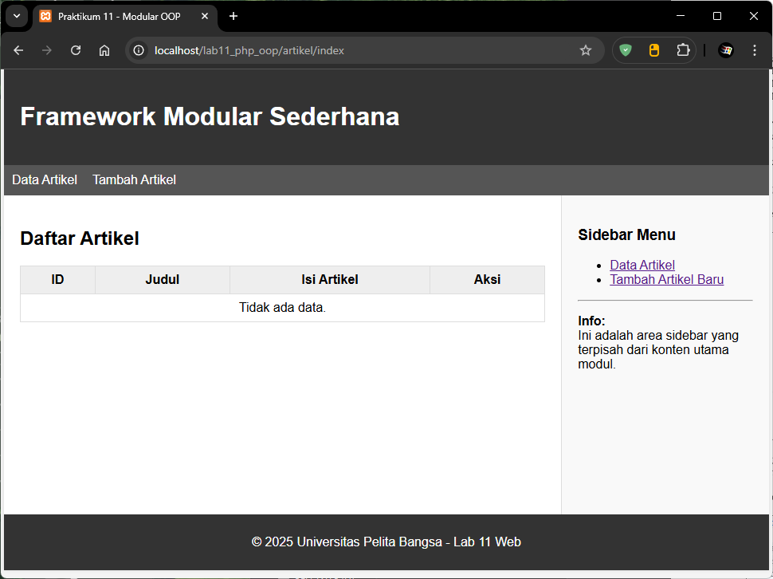
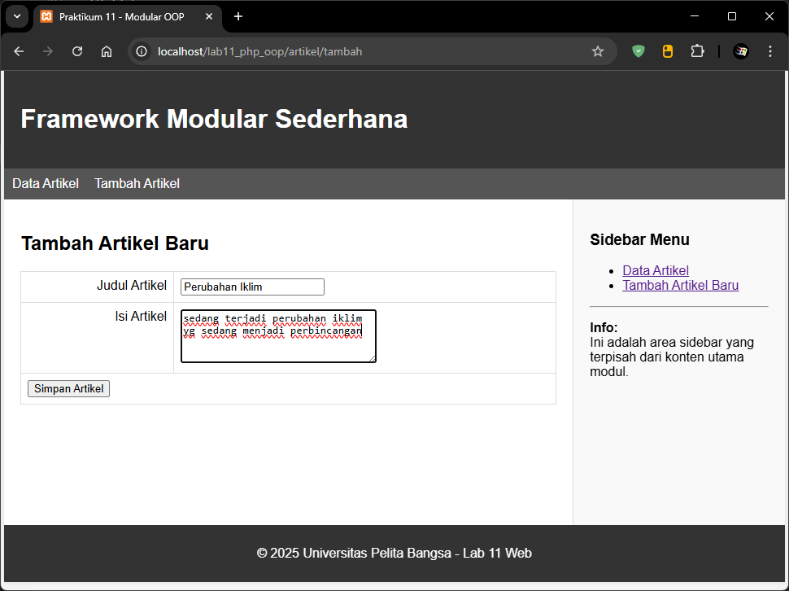
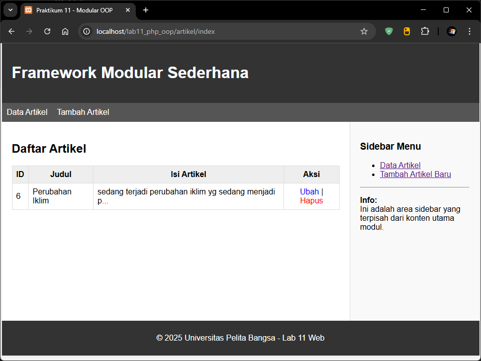
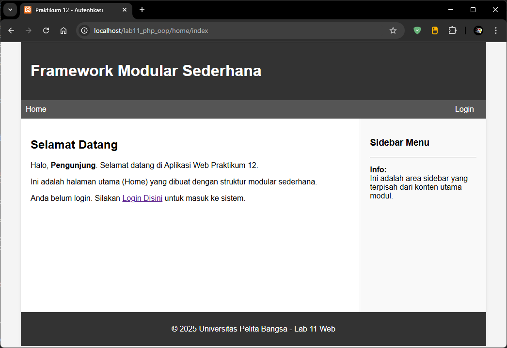
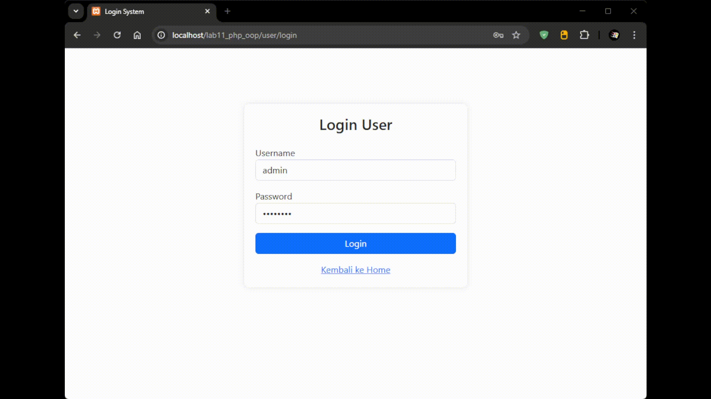
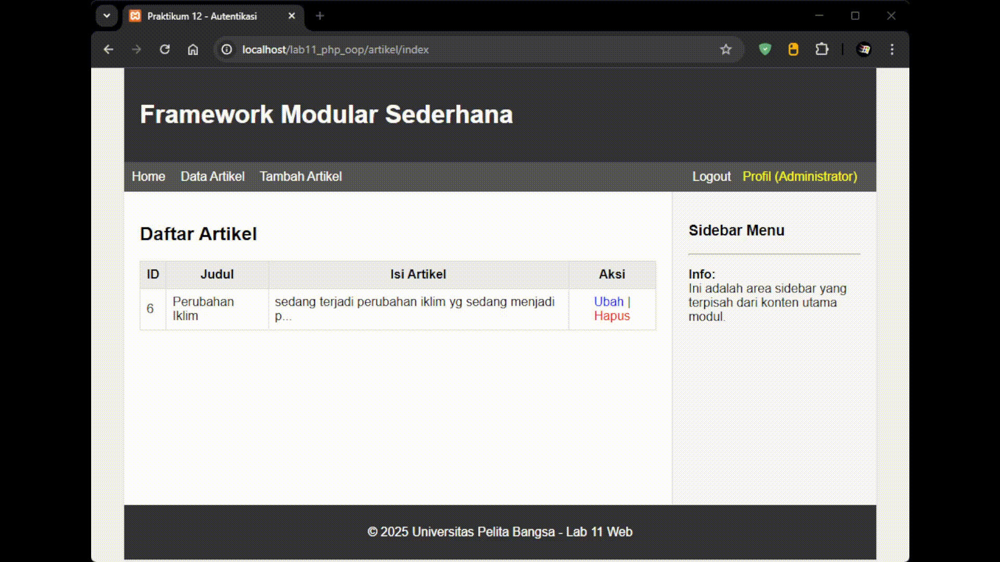
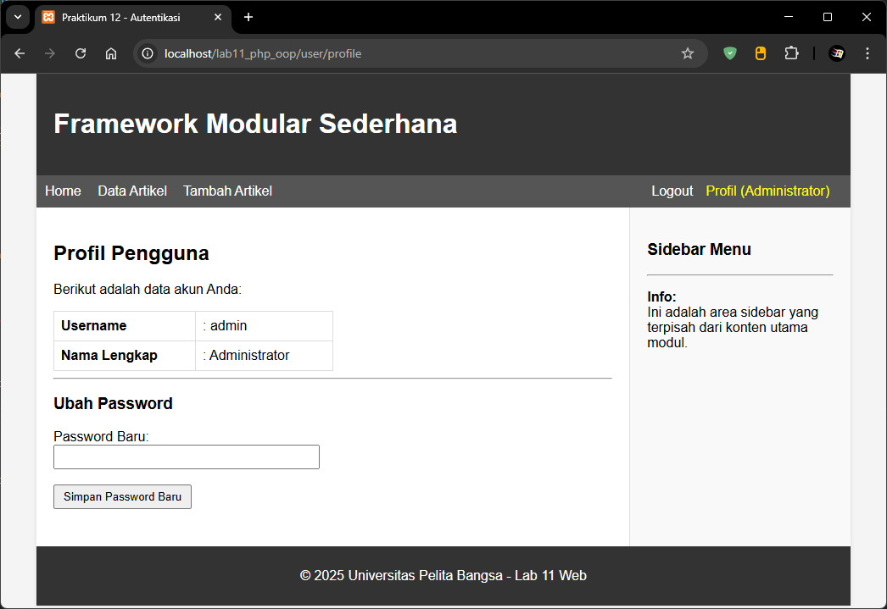

# Lab11Web

- Nama : Roufan Awaluna Romadhon
- NIM : 31240423
- Kelas : TI.24.A.3

---

## Deskripsi

Tugas ini untuk memahami konsep dasar Framework Modular, memahami konsep dasar routing dan membuar framework sederhana menggunakan PHP OOP.

## Langkah-langkah

### A. Perisapan Struktur Folder

```
lab11_php_oop/
├── .htaccess       (Konfigurasi URL Rewrite)
├── config.php      (Konfigurasi Database)
├── index.php       (Gerbang Utama / Routing)
├── class/          (Tempat menyimpan Library)
│ ├── Database.php
│ └── Form.php
├── module/         (Tempat modul-modul website)
│ └── artikel/
│ ├── index.php     (Menampilkan data)
│ ├── tambah.php    (Form tambah)
│ └── ubah.php
│ └── hapus.php
├── template/       (Bagian layout)
├── header.php
├── footer.php
└── sidebar.php
```

Langkah 1: Pindahkan file Database.php dan Form.php (dari praktikum sebelumnya) ke dalam folder class/.

File: form.php

```php
<?php
/**
  * Nama Class: Form
  * Deskripsi: Class untuk membuat form inputan dinamis (Text, Textarea, Select, Radio, Checkbox)
*/
class Form
{
    private $fields = array();
    private $action;
    private $submit = "Submit Form";
    private $jumField = 0;

    public function __construct($action, $submit)
    {
            $this->action = $action;
            $this->submit = $submit;
    }

    public function displayForm()
    {
        echo "<form action='" . $this->action . "' method='POST'>";
        echo '<table width="100%" border="0">';

        foreach ($this->fields as $field) {
            echo "<tr><td align='right' valign='top'>" . $field['label'] ."</td>";
            echo "<td>";
            
            // Logika untuk menentukan tipe input
            switch ($field['type']) {
                case 'textarea':
                    echo "<textarea name='" . $field['name'] . "' cols='30' rows='4'></textarea>";
                break;

                case 'select':
                    echo "<select name='" . $field['name'] . "'>";
                    foreach ($field['options'] as $value => $label) {
                        echo "<option value='" . $value . "'>" . $label . "</option>";
                    }
                    echo "</select>";
                    break;

                case 'radio':
                    foreach ($field['options'] as $value => $label) {
                        echo "<label><input type='radio' name='" . $field['name'] . "' value='" . $value . "'> " . $label . "</label> ";
                    }
                    break;

                case 'checkbox':
                    foreach ($field['options'] as $value => $label) {
                        // Untuk checkbox group, nama biasanya ditambah [] agar jadi array
                        echo "<label><input type='checkbox' name='" . $field['name'] . "[]' value='" . $value . "'> " . $label . "</label> ";
                    }
                    break;

                case 'password':
                    echo "<input type='password' name='" . $field['name'] . "'>";
                    break;

                default: // Defaultnya adalah text input biasa
                echo "<input type='text' name='" . $field['name'] . "'>";
                break;
            }

            echo "</td></tr>";
        }

        echo "<tr><td colspan='2'>";
        echo "<input type='submit' value='" . $this->submit . "'></td></tr>";
        echo "</table>";
        echo "</form>";
        }
    /**
    * addField
    * @param string $name Nama atribut (name="")
    * @param string $label Label untuk field
    * @param string $type Tipe input (text, textarea, select, radio, checkbox, password)
*     @param array $options Opsi untuk select/radio/checkbox (format:['value' => 'Label'])
    */

    public function addField($name, $label, $type = "text", $options = array())
    {
        $this->fields[$this->jumField]['name'] = $name;
        $this->fields[$this->jumField]['label'] = $label;
        $this->fields[$this->jumField]['type'] = $type;
        $this->fields[$this->jumField]['options'] = $options;
        $this->jumField++;
    }
}
?>
```

File: database.php

```php
<?php
class Database {
    protected $host;
    protected $user;
    protected $password;
    protected $db_name;
    protected $conn;

    public function __construct() {
        $this->getConfig();
        $this->conn = new mysqli($this->host, $this->user, $this->password, $this->db_name);
        if ($this->conn->connect_error) {
            die("Connection failed: " . $this->conn->connect_error);
        }
    }

    private function getConfig() {
        include("config.php");
        $this->host     = $config['host'];
        $this->user     = $config['username'];
        $this->password = $config['password'];
        $this->db_name  = $config['db_name'];
    }

    public function query($sql) {
        return $this->conn->query($sql);
    }

    public function get($table, $where = null) {
        $sql = "SELECT * FROM ".$table;

        if (!empty($where)) {
            $sql .= " WHERE " . $where;
        }

        $result = $this->conn->query($sql);

        if (!$result) {
            die("SQL Error: " . $this->conn->error);
        }

        return $result->fetch_assoc();
    }

    public function insert($table, $data) {
        $columns = implode(",", array_keys($data));
        $values  = "'" . implode("','", array_values($data)) . "'";

        $sql = "INSERT INTO $table ($columns) VALUES ($values)";
        return $this->conn->query($sql);
    }

    public function update($table, $data, $where) {
        $update_value = [];

        foreach ($data as $key => $val) {
            $update_value[] = "$key='{$val}'";
        }

        $update_value = implode(",", $update_value);

        $sql = "UPDATE $table SET $update_value WHERE $where";
        return $this->conn->query($sql);
    }

    public function delete($table, $filter) {
        $sql = "DELETE FROM $table $filter";
        return $this->conn->query($sql);
    }
}
?>
```

### B. Konfigurasi Dasar

File: config.php Sesuaikan dengan database anda

```php
<?php
$config = [
    'host' => 'localhost',
    'username' => 'root',
    'password' => '', // Sesuaikan dengan password database kamu
    'db_name' => 'database_artikel'
];
?>
```

## Tugas & Implemenntasi

Implementasikan konsep modularisasi dari praktikum sebelumnya dan terapkan konsep routing pada project yang baru.

### Jawab

kita buat file index.php dan .htaccess

File : index.php

```php
<?php
$db = new Database();
$data = $db->query("SELECT * FROM artikel");
?>

<h2>Daftar Artikel</h2>

<table border="1" cellpadding="10" cellspacing="0" style="width:100%; border-collapse: collapse;">
    <tr style="background:#eee;">
        <th>ID</th>
        <th>Judul</th>
        <th>Isi Artikel</th> <th>Aksi</th>
    </tr>
    <?php if ($data->num_rows > 0) : ?>
        <?php while ($row = $data->fetch_assoc()) : ?>
            <tr>
                <td><?= $row['id']; ?></td>
                <td><?= $row['judul']; ?></td>
                <td>
                    <?= substr($row['isi'], 0, 50) . (strlen($row['isi']) > 50 ? '...' : ''); ?>
                </td>
                <td align="center">
                    <a href="ubah?id=<?= $row['id']; ?>" style="text-decoration:none; color:blue;">Ubah</a> | 
                    <a href="hapus?id=<?= $row['id']; ?>" onclick="return confirm('Yakin hapus?')" style="text-decoration:none; color:red;">Hapus</a>
                </td>
            </tr>
        <?php endwhile; ?>
    <?php else: ?>
        <tr><td colspan="4" align="center">Tidak ada data.</td></tr>
    <?php endif; ?>
</table>
```

File : .htaccess

```.htaccess
<IfModule mod_rewrite.c>
RewriteEngine On
# Sesuaikan RewriteBase dengan nama folder project kamu
RewriteBase /lab11_php_oop/

# Jangan proses jika file/folder aslinya memang ada
RewriteCond %{REQUEST_FILENAME} !-d
RewriteCond %{REQUEST_FILENAME} !-f

# Arahkan semua request lain ke index.php
RewriteRule ^(.*)$ index.php/$1 [L]
</IfModule>
```

Untuk file yg lain kita pakai kode praktikum sebelumnnya.

### Hasil

1. Bagian Menu Utama



2. Bagian Menu Tambah


3. Membuat Artikel



4. Tampilan Menu Utama setelah menambah Artikel



# Update (Autentikasi dan Session)

## Deskripsi

Tugas ini untuk memahami konsep dasar Autentikasi, memhami konsep dasar Session dan mengimplementasikan Autentukasi sederhana. Untuk kali ini saya akan memperbarui praktikum ini dengan autentikasi dan session.

## Langkah-Langkah

### A. Perisapan Database

Kita membutuhkan tabel untuk menyimpan data pengguna (admin).

### 1. Buat Tabel users

Jalankan SQL berikut di phpMyAdmin pada database database_artikel:

```sql
CREATE TABLE users (
    id INT AUTO_INCREMENT PRIMARY KEY,
    username VARCHAR(50) NOT NULL,
    password VARCHAR(255) NOT NULL,
    nama VARCHAR(100)
);
```

### 2. Insert Data Dummy (User Admin)

Password harus di-hash (dienkripsi). Untuk contoh ini, kita buat user dengan password "admin123".
Jalankan SQL ini:

```sql
-- Password hash dari "admin123"
INSERT INTO users (username, password, nama)
VALUES ('admin', '$2y$10$uWdZ2x.hQfGqGz/..q7wue.3/a/e/e/e/e/e/e/e/e/e/e', 'Administrator');
```

Catatan: Hash di atas dihasilkan menggunakan password_hash('admin123', PASSWORD_DEFAULT).

### B. Update Routing (index.php)

Kita perlu memodifikasi index.php agar mengecek apakah user sudah login atau belum sebelum membuka halaman tertentu.

Buka dan edit file index.php:

```php
<?php
session_start(); // 1. Aktifkan session di baris paling atas 

// Load Konfigurasi & Library
if (file_exists("config.php")) include "config.php";
require "class/Database.php";
require "class/Form.php";

// Routing Logic
$path = isset($_SERVER['PATH_INFO']) ? $_SERVER['PATH_INFO'] : '/artikel/index';
$segments = explode('/', trim($path, '/'));

$mod = isset($segments[0]) ? $segments[0] : 'artikel';
$page = isset($segments[1]) ? $segments[1] : 'index';

// 2. Cek Session Login
// Halaman yang boleh diakses tanpa login
$public_pages = ['home', 'user']; 

if (!in_array($mod, $public_pages)) {
    // Jika mengakses halaman privat tapi belum login, lempar ke login
    if (!isset($_SESSION['is_login'])) {
        header('Location: http://localhost/lab11_php_oop/user/login');
        exit();
    }
}

// Tentukan file modul
$file = "module/{$mod}/{$page}.php";

// Logika Tampilan: Jangan load header/footer/sidebar jika sedang di halaman login
if ($mod == 'user' && $page == 'login') {
    if (file_exists($file)) {
        include $file;
    } else {
        echo "Halaman login tidak ditemukan.";
    }
} else {
    // Load Template Utama
    include "template/header.php";
    
    if (file_exists($file)) {
        include $file;
    } else {
        echo "<div style='margin:20px; color:red;'>Modul tidak ditemukan: <b>{$mod}/{$page}</b></div>";
    }

    include "template/sidebar.php";
    include "template/footer.php";
}
?>
```

### C. Membuat Modul User (Login & Logout)

Buat folder baru: module/user/.

### 1. File: module/user/login.php

Halaman ini berisi Form Login dan logika pemrosesan saat tombol submit ditekan.

```php
<?php
// Cek jika sudah login, langsung ke home
if (isset($_SESSION['is_login'])) {
    header('Location: http://localhost/lab11_php_oop/home/index');
    exit;
}

$message = "";

// Logika Proses Login
if ($_POST) {
    $db = new Database();
    $username = $_POST['username'];
    $password = $_POST['password'];

    // Query cari user
    $sql = "SELECT * FROM users WHERE username = '{$username}' LIMIT 1";
    $result = $db->query($sql);
    
    // Karena query() di class Database kita mengembalikan objek mysqli_result untuk SELECT
    if ($result && $result->num_rows > 0) {
        $data = $result->fetch_assoc();
        
        // Verifikasi password hash
        if (password_verify($password, $data['password'])) {
            // Login Sukses: Set Session
            $_SESSION['is_login'] = true;
            $_SESSION['username'] = $data['username'];
            $_SESSION['nama'] = $data['nama'];
            
            // Redirect ke halaman artikel
            header('Location: http://localhost/lab11_php_oop/artikel/index');
            exit;
        } else {
            $message = "Password salah!";
        }
    } else {
        $message = "Username tidak ditemukan!";
    }
}
?>
<!DOCTYPE html>
<html lang="en">
<head>
    <title>Login System</title>
    <link href="https://cdn.jsdelivr.net/npm/bootstrap@5.3.0/dist/css/bootstrap.min.css" rel="stylesheet">
    <style>
        .login-container { max-width: 400px; margin: 100px auto; padding: 20px; box-shadow: 0 0 10px rgba(0,0,0,0.1); border-radius: 8px; }
    </style>
</head>
<body>
    <div class="login-container">
        <h3 class="text-center mb-4">Login User</h3>
        <?php if ($message): ?>
            <div class="alert alert-danger"><?= $message ?></div>
        <?php endif; ?>
        
        <form method="POST" action="">
            <div class="mb-3">
                <label>Username</label>
                <input type="text" name="username" class="form-control" required>
            </div>
            <div class="mb-3">
                <label>Password</label>
                <input type="password" name="password" class="form-control" required>
            </div>
            <div class="d-grid">
                <button type="submit" class="btn btn-primary">Login</button>
            </div>
        </form>
        <div class="mt-3 text-center">
            <a href="../home/index">Kembali ke Home</a>
        </div>
    </div>
</body>
</html>
```

### 2. File: module/user/logout.php

File untuk menghapus session.

```php
<?php
session_destroy();
header('Location: http://localhost/lab11_php_oop/user/login');
exit;
?>
```

### D. Penyesuaian Tampilan (Header)

Kita perlu mengubah template/header.php agar menu navigasi berubah dinamis:

- Jika Belum Login: Tampilkan menu Home dan Login.
- Jika Sudah Login: Tampilkan menu Home, Artikel, dan Logout.


### Update template/header.php:

```php
<!DOCTYPE html>
<html lang="en">
<head>
    <meta charset="UTF-8">
    <title>Praktikum 12 - Autentikasi</title>
    <style>
        body { font-family: sans-serif; margin: 0; background-color: #f4f4f4; }
        .wrapper { width: 960px; margin: 0 auto; background: #fff; box-shadow: 0 0 5px rgba(0,0,0,0.1); }
        header { background: #333; color: #fff; padding: 20px; }
        nav { background: #555; padding: 10px; }
        nav a { color: #fff; text-decoration: none; margin-right: 15px; }
        nav a:hover { text-decoration: underline; }
        .content-area { display: flex; min-height: 400px; }
        .main-content { flex: 3; padding: 20px; border-right: 1px solid #ddd; }
        .sidebar { flex: 1; padding: 20px; background: #f9f9f9; }
        footer { background: #333; color: #fff; text-align: center; padding: 10px; clear: both; }
        table { width: 100%; border-collapse: collapse; margin-top:10px; }
        th, td { border: 1px solid #ddd; padding: 8px; }
    </style>
</head>
<body>
    <div class="wrapper">
        <header>
            <h1>Framework Modular Sederhana</h1>
        </header>
        <nav>
            <a href="http://localhost/lab11_php_oop/home/index">Home</a>
            
            <?php if (isset($_SESSION['is_login'])): ?>
                <a href="http://localhost/lab11_php_oop/artikel/index">Data Artikel</a>
                <a href="http://localhost/lab11_php_oop/artikel/tambah">Tambah Artikel</a>
                <a href="http://localhost/lab11_php_oop/user/profile" style="float:right; color:yellow;">Profil (<?= $_SESSION['nama'] ?>)</a>
                <a href="http://localhost/lab11_php_oop/user/logout" style="float:right;">Logout</a>
            <?php else: ?>
                <a href="http://localhost/lab11_php_oop/user/login" style="float:right;">Login</a>
            <?php endif; ?>
        </nav>
        
        <div class="content-area"> 
            <div class="main-content">
```

### E. Langkah Uji Coba

1. Akses Halaman Artikel (Tanpa Login):

Buka browser: http://localhost/lab11_php_oop/artikel/index.
Hasil: Kamu seharusnya otomatis terlempar (redirect) ke halaman user/login.



2. Lakukan Login:

Masukkan username: admin dan password: admin123.
Hasil: Jika sukses, kamu akan diarahkan ke halaman artikel, dan di pojok kanan atas muncul menu "Logout (Administrator)".

Gif


3. Akses CRUD:

Coba tambah, edit, atau hapus data. Semua harus berjalan normal.

Gif


4. Logout:

Klik menu Logout. Kamu akan kembali ke halaman login.

Gif 


### F. Tugas Praktikum

1. Tambahkan fitur "Profil". Buat halaman di module/user/profile.php yang menampilkan data user yang sedang login (Nama, Username) dan form untuk mengubah Password.

2. Implementasikan logika enkripsi password (password_hash) saat mengubah password di fitur profil tersebut.

### Jawab:

Unuk menambah halaman profil maka harus menambahkan file profile.php di folder module/user. Berikut Kodenya.

### File: module/user/logout.php

```php
<?php
// Pastikan hanya user login yang bisa akses
if (!isset($_SESSION['is_login'])) {
    header('Location: login');
    exit;
}

$db = new Database();
$message = "";

// Proses Ganti Password
if ($_POST) {
    $password_baru = $_POST['password_baru'];
    
    if (!empty($password_baru)) {
        // Enkripsi Password Baru [cite: 1371]
        $password_hash = password_hash($password_baru, PASSWORD_DEFAULT);
        
        $username = $_SESSION['username'];
        $sql = "UPDATE users SET password = '{$password_hash}' WHERE username = '{$username}'";
        
        if ($db->query($sql)) {
            $message = "<div style='color:green'>Password berhasil diubah!</div>";
        } else {
            $message = "<div style='color:red'>Gagal mengubah password.</div>";
        }
    } else {
        $message = "<div style='color:red'>Password tidak boleh kosong.</div>";
    }
}
?>

<h2>Profil Pengguna</h2>
<p>Berikut adalah data akun Anda:</p>

<table style="width: 50%; border:none;">
    <tr>
        <td width="150"><strong>Username</strong></td>
        <td>: <?= $_SESSION['username']; ?></td>
    </tr>
    <tr>
        <td><strong>Nama Lengkap</strong></td>
        <td>: <?= $_SESSION['nama']; ?></td>
    </tr>
</table>

<hr>
<h3>Ubah Password</h3>
<?= $message; ?>

<form method="POST" action="">
    <label>Password Baru:</label><br>
    <input type="password" name="password_baru" style="width: 300px; padding: 5px;" required><br><br>
    
    <input type="submit" value="Simpan Password Baru" style="padding: 5px 10px;">
</form>
```




